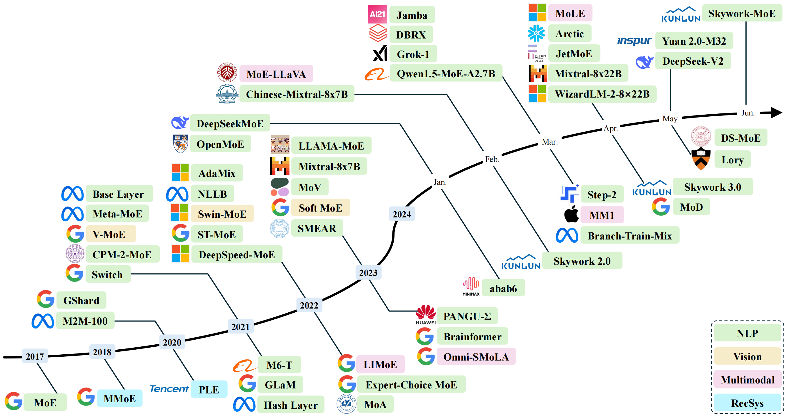
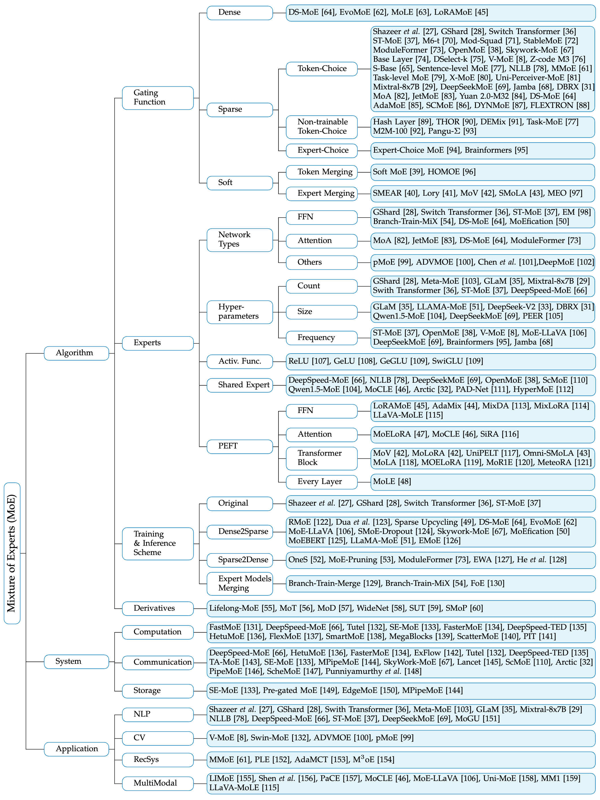

<p align="center" width="100%">

</p>

<div align="center">
  <h1>A Survey on Mixture of Experts</h1>
  <a href="https://awesome.re">
    
  </a>
  <a href="https://img.shields.io/badge/PRs-Welcome-red">
    
  </a>
  <a href="https://img.shields.io/github/last-commit/withinmiaov/A-Survey-on-Mixture-of-Experts?color=green">
    
  </a>
</div>

<p align="center" width="100%">
  
  <br>
    A chronological overview of several representative Mixture-of-Experts (MoE) models in recent years. The timeline is primarily structured according to the release dates of the models. MoE models located above the arrow are open-source, while those below the arrow are proprietary and closed-source. MoE models from various domains are marked with distinct colors: Natural Language Processing (NLP) in green, Computer Vision in yellow, Multimodal in pink, and Recommender Systems (RecSys) in cyan.
</p>

> [!IMPORTANT]
> 
> A curated collection of papers and resources on Mixture of Experts with Large Language Models.
> 
> Please refer to our survey [**"A Survey on Mixture of Experts"**](https://arxiv.org/abs/2407.06204) for the detailed contents. [](https://arxiv.org/abs/2407.06204)
> 
> Please let us know if you discover any mistakes or have suggestions by emailing us: wcai738@connect.hkust-gz.edu.cn
> 
> If you find our survey beneficial for your research, please consider citing the following paper:

```Bibtex
@article{cai2024survey,
  title={A Survey on Mixture of Experts},
  author={Cai, Weilin and Jiang, Juyong and Wang, Fan and Tang, Jing and Kim, Sunghun and Huang, Jiayi},
  journal={arXiv preprint arXiv:2407.06204},
  year={2024}
}
```

## Table of Contents
- [Taxonomy](#taxonomy)
- [Paper List (Organized Chronologically and Categorically)](#paper-list-organized-chronologically-and-categorically)
- [Contributors](#contributors)
- [Star History](#star-history)

## Taxonomy

<p align="center" width="100%">
  
</p>


<div align="right">
    <b><a href="#table-of-contents">↥ back to top</a></b>
</div>


## Paper List (Organized Chronologically and Categorically)

- M4oE: A Foundation Model for Medical Multimodal Image Segmentation with Mixture of Experts, [[MICCAI 2024]](https://papers.miccai.org/miccai-2024/paper/1472_paper.pdf), 2024-05-15

- MoH: Multi-Head Attention as Mixture-of-Head Attention, [[ArXiv 2024]](https://arxiv.org/abs/2410.11842v1), 2024-10-15

- Mixture of A Million Experts, [[ArXiv 2024]](https://arxiv.org/abs/2407.04153), 2024-7-4

- Flextron: Many-in-One Flexible Large Language Model, [[ICML 2024]](https://arxiv.org/abs/2406.10260), 2024-6-11

- Demystifying the Compression of Mixture-of-Experts Through a Unified Framework, [[ArXiv 2024]](https://arxiv.org/abs/2406.02500), 2024-6-4

- Skywork-MoE: A Deep Dive into Training Techniques for Mixture-of-Experts Language Models, [[ArXiv 2024]](https://github.com/SkyworkAI/Skywork-MoE), 2024-6-3

- Yuan 2.0-M32: Mixture of Experts with Attention Router, [[ArXiv 2024]](https://arxiv.org/abs/2405.17976), 2024-5-28

- MoGU: A Framework for Enhancing Safety of Open-Sourced LLMs While Preserving Their Usability, [[ArXiv 2024]](https://arxiv.org/abs/2405.14488), 2024-5-23

- Dynamic Mixture of Experts: An Auto-Tuning Approach for Efficient Transformer Models, [[ArXiv 2024]](https://arxiv.org/abs/2405.14297), 2024-5-23

- Unchosen Experts Can Contribute Too: Unleashing MoE Models' Power by Self-Contrast, [[ArXiv 2024]](https://arxiv.org/abs/2405.14507), 2024-5-23

- MeteoRA: Multiple-tasks Embedded LoRA for Large Language Models, [[ArXiv 2024]](https://arxiv.org/abs/2405.13053), 2024-5-19

- Uni-MoE: Scaling Unified Multimodal LLMs with Mixture of Experts, [[ArXiv 2024]](https://arxiv.org/abs/2405.11273), 2024-5-18

- Optimizing Distributed ML Communication with Fused Computation-Collective Operations, [[ArXiv 2023]](https://arxiv.org/abs/2305.06942), 2023-5-11

- DeepSeek-V2: A Strong, Economical, and Efficient Mixture-of-Experts Language Model, [[ArXiv 2024]](https://arxiv.org/abs/2405.04434), 2024-5-7

- Lory: Fully Differentiable Mixture-of-Experts for Autoregressive Language Model Pre-training, [[ArXiv 2024]](https://arxiv.org/abs/2405.03133), 2024-5-6

- Lancet: Accelerating Mixture-of-Experts Training via Whole Graph Computation-Communication Overlapping, [[ArXiv 2024]](https://arxiv.org/abs/2404.19429), 2024-4-30

- M3oE: Multi-Domain Multi-Task Mixture-of Experts Recommendation Framework, [[SIGIR 2024]](https://arxiv.org/abs/2404.18465), 2024-4-29

- Multi-Head Mixture-of-Experts, [[ArXiv 2024]](https://arxiv.org/abs/2404.15045), 2024-4-23

- ScheMoE: An Extensible Mixture-of-Experts Distributed Training System with Tasks Scheduling, [[EuroSys 2024]](https://dl.acm.org/doi/10.1145/3627703.3650083), 2024-4-22

- MixLoRA: Enhancing Large Language Models Fine-Tuning with LoRA-based Mixture of Experts, [[ArXiv 2024]](https://arxiv.org/abs/2404.15159), 2024-4-22

- Intuition-aware Mixture-of-Rank-1-Experts for Parameter Efficient Finetuning, [[ArXiv 2024]](https://arxiv.org/abs/2404.08985), 2024-4-13

- JetMoE: Reaching Llama2 Performance with 0.1M Dollars, [[ArXiv 2024]](https://arxiv.org/abs/2404.07413), 2024-4-11

- Dense Training, Sparse Inference: Rethinking Training of Mixture-of-Experts Language Models, [[ArXiv 2024]](https://arxiv.org/abs/2404.05567), 2024-4-8

- Shortcut-connected Expert Parallelism for Accelerating Mixture-of-Experts, [[ArXiv 2024]](https://arxiv.org/abs/2404.05019), 2024-4-7

- Mixture-of-Depths: Dynamically allocating compute in transformer-based language models	[[ArXiv 2024]](https://arxiv.org/abs/2404.02258), 2024-4-2

- MTLoRA: A Low-Rank Adaptation Approach for Efficient Multi-Task Learning	[[ArXiv 2024]](https://arxiv.org/abs/2403.20320), 2024-3-29

- Jamba: A Hybrid Transformer-Mamba Language Model, [[ArXiv 2024]](https://arxiv.org/abs/2403.19887), 2024-3-28

- Scattered Mixture-of-Experts Implementation, [[ArXiv 2024]](https://arxiv.org/abs/2403.08245), 2024-3-13

- Branch-Train-MiX: Mixing Expert LLMs into a Mixture-of-Experts LLM	[[ArXiv 2024]](https://arxiv.org/abs/2403.07816), 2024-3-12

- HyperMoE: Towards Better Mixture of Experts via Transferring Among Experts, [[ACL 2024]](https://arxiv.org/abs/2402.12656), 2024-2-20

- Higher Layers Need More LoRA Experts	[[ArXiv 2024]](https://arxiv.org/abs/2402.08562), 2024-2-13

- FuseMoE: Mixture-of-Experts Transformers for Fleximodal Fusion, [[ArXiv 2024]](https://arxiv.org/abs/2402.03226), 2024-2-5

- MoE-LLaVA: Mixture of Experts for Large Vision-Language Models	[[ArXiv 2024]](https://arxiv.org/abs/2401.15947), 2024-1-29

- OpenMoE: An Early Effort on Open Mixture-of-Experts Language Models	[[ArXiv 2024]](https://arxiv.org/abs/2402.01739), 2024-1-29

- LLaVA-MoLE: Sparse Mixture of LoRA Experts for Mitigating Data Conflicts in Instruction Finetuning MLLMs	[[ArXiv 2024]](https://arxiv.org/abs/2401.16160), 2024-1-29

- Exploiting Inter-Layer Expert Affinity for Accelerating Mixture-of-Experts Model Inference	[[ArXiv 2024]](https://arxiv.org/abs/2401.08383), 2024-1-16

- MOLE: MIXTURE OF LORA EXPERTS	[[ICLR 2024]](https://openreview.net/forum?id=uWvKBCYh4S), 2024-1-16

- DeepSeekMoE: Towards Ultimate Expert Specialization in Mixture-of-Experts Language Models	[[ArXiv 2024]](https://arxiv.org/abs/2401.06066), 2024-1-11

- LLaMA-MoE: Building Mixture-of-Experts from LLaMA with Continual Pre-training, [[Github 2023]](https://github.com/pjlab-sys4nlp/llama-moe/blob/main/docs/LLaMA_MoE.pdf), 2023-12

- Mixture of Cluster-conditional LoRA Experts for Vision-language Instruction Tuning	[[ArXiv 2023]](https://arxiv.org/abs/2312.12379), 2023-12-19

- LoRAMoE: Alleviate World Knowledge Forgetting in Large Language Models via MoE-Style Plugin	[[ArXiv 2023]](https://arxiv.org/abs/2312.09979), 2023-12-15

- Mixtral of Experts, [[ArXiv 2024]](https://arxiv.org/abs/2401.04088), 2023-12-11

- Omni-SMoLA: Boosting Generalist Multimodal Models with Soft Mixture of Low-rank Experts	[[ArXiv 2023]](https://arxiv.org/abs/2312.00968), 2023-12-1

- HOMOE: A Memory-Based and Composition-Aware Framework for Zero-Shot Learning with Hopfield Network and Soft Mixture of Experts, [[ArXiv 2023]](https://arxiv.org/abs/2311.14747), 2023-11-23

- Sira: Sparse mixture of low rank adaptation, [[ArXiv 2023]](https://arxiv.org/abs/2311.09179), 2023-11-15

- When MOE Meets LLMs: Parameter Efficient Fine-tuning for Multi-task Medical Applications, [[SIGIR 2024]](https://arxiv.org/abs/2310.18339), 2023-10-21

- Unlocking Emergent Modularity in Large Language Models, [[NAACL 2024]](https://arxiv.org/abs/2310.10908), 2023-10-17

- Merging Experts into One: Improving Computational Efficiency of Mixture of Experts, [[EMNLP 2023]](https://arxiv.org/abs/2310.09832), 2023-10-15

- Sparse Universal Transformer, [[EMNLP 2023]](https://arxiv.org/abs/2310.07096), 2023-10-11

- SMoP: Towards Efficient and Effective Prompt Tuning with Sparse Mixture-of-Prompts, [[EMNLP 2023]](https://openreview.net/forum?id=5x5Vxclc1K), 2023-10-8

- FUSING MODELS WITH COMPLEMENTARY EXPERTISE	[[ICLR 2024]](https://arxiv.org/abs/2310.01542), 2023-10-2

- Pushing Mixture of Experts to the Limit: Extremely Parameter Efficient MoE for Instruction Tuning	[[ICLR 2024]](https://arxiv.org/abs/2309.05444), 2023-9-11

- EdgeMoE: Fast On-Device Inference of MoE-based Large Language Models	[[ArXiv 2023]](https://arxiv.org/abs/2308.14352), 2023-8-28

- Pre-gated MoE: An Algorithm-System Co-Design for Fast and Scalable Mixture-of-Expert Inference	[[ArXiv 2023]](https://arxiv.org/abs/2308.12066), 2023-8-23

- Robust Mixture-of-Expert Training for Convolutional Neural Networks, [[ICCV 2023]](https://arxiv.org/abs/2308.10110v1), 2023-8-19

- Experts Weights Averaging: A New General Training Scheme for Vision Transformers, [[ArXiv 2023]](https://arxiv.org/abs/2308.06093), 2023-8-11

- From Sparse to Soft Mixtures of Experts	[ICLR 2024](https://arxiv.org/abs/2308.00951), 2023-8-2

- SmartMoE: Efficiently Training Sparsely-Activated Models through Combining Offline and Online Parallelization	[[USENIX ATC 2023]](https://www.usenix.org/conference/atc23/presentation/zhai), 2023-7-10

- Mixture-of-Domain-Adapters: Decoupling and Injecting Domain Knowledge to Pre-trained Language Models’ Memories	[[ACL 2023]](https://arxiv.org/abs/2306.05406), 2023-6-8

- Moduleformer: Learning modular large language models from uncurated data, [[ArXiv 2023]](https://arxiv.org/abs/2306.04640), 2023-6-7

- Patch-level Routing in Mixture-of-Experts is Provably Sample-efficient for Convolutional Neural Networks, [[ICML 2023]](https://arxiv.org/abs/2306.04073), 2023-6-7

- Soft Merging of Experts with Adaptive Routing, [[TMLR 2024]](https://arxiv.org/abs/2306.03745), 2023-6-6

- Brainformers: Trading Simplicity for Efficiency, [[ICML 2023]](https://arxiv.org/abs/2306.00008), 2023-5-29

- Emergent Modularity in Pre-trained Transformers, [[ACL 2023]](https://arxiv.org/abs/2305.18390), 2023-5-28

- PaCE: Unified Multi-modal Dialogue Pre-training with Progressive and Compositional Experts, [[ACL 2023]](https://arxiv.org/abs/2305.14839), 2023-5-24

- Mixture-of-Experts Meets Instruction Tuning: A Winning Combination for Large Language Models	[[ICLR 2024]](https://arxiv.org/abs/2305.14705), 2023-5-24

- PipeMoE: Accelerating Mixture-of-Experts through Adaptive Pipelining, [[INFOCOM 2023]](https://ieeexplore.ieee.org/document/10228874), 2023-5-17

- MPipeMoE: Memory Efficient MoE for Pre-trained Models with Adaptive Pipeline Parallelism	[[IPDPS 2023]](https://ieeexplore.ieee.org/document/10177396), 2023-5-15

- FlexMoE: Scaling Large-scale Sparse Pre-trained Model Training via Dynamic Device Placement	[[Proc. ACM Manag. Data 2023]](https://arxiv.org/abs/2304.03946), 2023-4-8

- PANGU-Σ: TOWARDS TRILLION PARAMETER LANGUAGE MODEL WITH SPARSE HETEROGENEOUS COMPUTING	[[ArXiv 2023]](https://arxiv.org/abs/2303.10845), 2023-3-20

- Scaling Vision-Language Models with Sparse Mixture of Experts	[EMNLP (Findings) 2023](https://arxiv.org/abs/2303.07226), 2023-3-13

- A Hybrid Tensor-Expert-Data Parallelism Approach to Optimize Mixture-of-Experts Training	[[ICS 2023]](https://arxiv.org/abs/2303.06318), 2023-3-11

- SPARSE MOE AS THE NEW DROPOUT: SCALING DENSE AND SELF-SLIMMABLE TRANSFORMERS	[[ICLR 2023]](https://arxiv.org/abs/2303.01610), 2023-3-2

- TA-MoE: Topology-Aware Large Scale Mixture-of-Expert Training	[[NIPS 2022]](https://arxiv.org/abs/2302.09915), 2023-2-20

- PIT: Optimization of Dynamic Sparse Deep Learning Models via Permutation Invariant Transformation, [[SOSP 2023]](https://arxiv.org/abs/2301.10936), 2023-1-26

- Mod-Squad: Designing Mixture of Experts As Modular Multi-Task Learners, [[CVPR 2023]](https://arxiv.org/abs/2212.08066), 2022-12-15

- Hetu: a highly efficient automatic parallel distributed deep learning system	[[Sci. China Inf. Sci. 2023]](https://link.springer.com/article/10.1007/s11432-022-3581-9), 2022-12

- MEGABLOCKS: EFFICIENT SPARSE TRAINING WITH MIXTURE-OF-EXPERTS	[[MLSys 2023]](https://arxiv.org/abs/2211.15841), 2022-11-29

- PAD-Net: An Efficient Framework for Dynamic Networks, [[ACL 2023]](https://arxiv.org/abs/2211.05528), 2022-11-10

- Mixture of Attention Heads: Selecting Attention Heads Per Token, [[EMNLP 2022]](https://arxiv.org/abs/2210.05144), 2022-10-11

- Sparsity-Constrained Optimal Transport, [[ICLR 2023]](https://arxiv.org/abs/2209.15466), 2022-9-30

- A Review of Sparse Expert Models in Deep Learning, [[ArXiv 2022]](https://arxiv.org/abs/2209.01667), 2022-9-4

- A Theoretical View on Sparsely Activated Networks	[[NIPS 2022]](https://arxiv.org/abs/2208.04461), 2022-8-8

- Branch-Train-Merge: Embarrassingly Parallel Training of Expert Language Models	[[NIPS 2022]](https://arxiv.org/abs/2208.03306), 2022-8-5

- Towards Understanding Mixture of Experts in Deep Learning, [[ArXiv 2022]](https://arxiv.org/abs/2208.02813), 2022-8-4

- No Language Left Behind: Scaling Human-Centered Machine Translation	[[ArXiv 2022]](https://arxiv.org/abs/2207.04672), 2022-7-11

- Uni-Perceiver-MoE: Learning Sparse Generalist Models with Conditional MoEs	[[NIPS 2022]](https://arxiv.org/abs/2206.04674), 2022-6-9

- TUTEL: ADAPTIVE MIXTURE-OF-EXPERTS AT SCALE	[[MLSys 2023]](https://arxiv.org/abs/2206.03382), 2022-6-7

- Multimodal Contrastive Learning with LIMoE: the Language-Image Mixture of Experts	[[NIPS 2022]](https://arxiv.org/abs/2206.02770), 2022-6-6

- Task-Specific Expert Pruning for Sparse Mixture-of-Experts	[[ArXiv 2022]](https://arxiv.org/abs/2206.00277), 2022-6-1

- Eliciting and Understanding Cross-Task Skills with Task-Level Mixture-of-Experts, [[EMNLP 2022]](https://arxiv.org/abs/2205.12701), 2022-5-25

- AdaMix: Mixture-of-Adaptations for Parameter-efficient Model Tuning, [[EMNLP 2022]](https://arxiv.org/abs/2205.12410), 2022-5-24

- SE-MoE: A Scalable and Efficient Mixture-of-Experts Distributed Training and Inference System, [[ArXiv 2022]](https://arxiv.org/abs/2205.10034), 2022-5-20

- On the Representation Collapse of Sparse Mixture of Experts	[[NIPS 2022]](https://arxiv.org/abs/2204.09179), 2022-4-20

- Residual Mixture of Experts, [[ArXiv 2022]](https://arxiv.org/abs/2204.09636), 2022-4-20

- STABLEMOE: Stable Routing Strategy for Mixture of Experts	[[ACL 2022]](https://arxiv.org/abs/2204.08396), 2022-4-18

- MoEBERT: from BERT to Mixture-of-Experts via Importance-Guided Adaptation, [[NAACL 2022]](https://arxiv.org/abs/2204.07675), 2022-4-15

- BaGuaLu: Targeting Brain Scale Pretrained Models with over 37 Million Cores	[[PPoPP 2022]](https://dl.acm.org/doi/10.1145/3503221.3508417), 2022-3-28

- FasterMoE: Modeling and Optimizing Training of Large-Scale Dynamic Pre-Trained Models	[[PPoPP 2022]](https://dl.acm.org/doi/10.1145/3503221.3508418), 2022-3-28

- HetuMoE: An Efficient Trillion-scale Mixture-of-Expert Distributed Training System	[[ArXiv 2022]](https://arxiv.org/abs/2203.14685), 2022-3-28

- Parameter-Efficient Mixture-of-Experts Architecture for Pre-trained Language Models	[[COLING 2022]](https://arxiv.org/abs/2203.01104), 2022-3-2

- Mixture-of-Experts with Expert Choice Routing	[[NIPS 2022]](https://arxiv.org/abs/2202.09368), 2022-2-18

- ST-MOE: DESIGNING STABLE AND TRANSFERABLE SPARSE EXPERT MODELS	[[ArXiv 2022]](https://arxiv.org/abs/2202.08906), 2022-2-17

- UNIFIED SCALING LAWS FOR ROUTED LANGUAGE MODELS	[[ICML 2022]](https://arxiv.org/abs/2202.01169), 2022-2-2

- One Student Knows All Experts Know: From Sparse to Dense, [[ArXiv 2022]](https://arxiv.org/abs/2201.10890), 2022-1-26

- DeepSpeed-MoE: Advancing Mixture-of-Experts Inference and Training to Power Next-Generation AI Scale	[[ICML 2022]](https://arxiv.org/abs/2201.05596), 2022-1-14

- EvoMoE: An Evolutional Mixture-of-Experts Training Framework via Dense-To-Sparse Gate	[[ArXiv 2021]](https://arxiv.org/abs/2112.14397), 2021-12-29

- Efficient Large Scale Language Modeling with Mixtures of Experts	[[EMNLP 2022]](https://arxiv.org/abs/2112.10684), 2021-12-20

- GLaM: Efficient Scaling of Language Models with Mixture-of-Experts	[[ICML 2022]](https://arxiv.org/abs/2112.06905), 2021-12-13

- Dselect-k: Differentiable selection in the mixture of experts with applications to multi-task learning, [[NIPS 2021]](https://proceedings.neurips.cc/paper_files/paper/2021/hash/f5ac21cd0ef1b88e9848571aeb53551a-Abstract.html), 2021.12.6

- Tricks for Training Sparse Translation Models, [[NAACL 2022]](https://arxiv.org/abs/2110.08246), 2021-10-15

- Taming Sparsely Activated Transformer with Stochastic Experts, [[ICLR 2022]](https://arxiv.org/abs/2110.04260), 2021-10-8

- MoEfication: Transformer Feed-forward Layers are Mixtures of Experts, [[ACL 2022]](https://arxiv.org/abs/2110.01786), 2021-10-5

- Beyond distillation: Task-level mixture-of-experts for efficient inference, [[EMNLP 2021]](https://arxiv.org/abs/2110.03742), 2021-9-24

- Scalable and Efficient MoE Training for Multitask Multilingual Models, [[ArXiv 2021]](https://arxiv.org/abs/2109.10465), 2021-9-22

- DEMix Layers: Disentangling Domains for Modular Language Modeling, [[NAACL 2022]](https://arxiv.org/abs/2108.05036), 2021-8-11

- Go Wider Instead of Deeper	[[AAAI 2022]](https://arxiv.org/abs/2107.11817), 2021-7-25

- Scaling Vision with Sparse Mixture of Experts	[[NIPS 2021]](https://arxiv.org/abs/2106.05974), 2021-6-10

- Hash Layers For Large Sparse Models	[[NIPS 2021]](https://arxiv.org/abs/2106.04426), 2021-6-8

- M6-t: Exploring sparse expert models and beyond, [[ArXiv 2021]](https://arxiv.org/abs/2105.15082), 2021-5-31

- BASE Layers: Simplifying Training of Large, Sparse Models	[[ICML 2021]](https://arxiv.org/abs/2103.16716), 2021-5-30

- FASTMOE: A FAST MIXTURE-OF-EXPERT TRAINING SYSTEM	[[ArXiv 2021]](https://arxiv.org/abs/2103.13262), 2021-5-21

- CPM-2: Large-scale Cost-effective Pre-trained Language Models, [[AI Open 2021]](https://arxiv.org/abs/2106.10715), 2021-1-20

- Switch Transformers: Scaling to Trillion Parameter Models with Simple and Efficient Sparsity	[[ArXiv 2022]](https://arxiv.org/abs/2101.03961), 2021-1-11

- Beyond English-Centric Multilingual Machine Translation, [[JMLR 2021]](https://arxiv.org/abs/2010.11125), 2020-10-21

- GShard: Scaling Giant Models with Conditional Computation and Automatic Sharding	[[ICLR 2021]](https://arxiv.org/abs/2006.16668), 2020-6-30

- Modeling task relationships in multi-task learning with multi-gate mixture-of-experts, [[KDD 2018]](https://arxiv.org/abs/2010.11125), 2018-7-19

- OUTRAGEOUSLY LARGE NEURAL NETWORKS: THE SPARSELY-GATED MIXTURE-OF-EXPERTS LAYER	[[ICLR 2017]](https://arxiv.org/abs/1701.06538), 2017-1-23


<div align="right">
    <b><a href="#table-of-contents">↥ back to top</a></b>
</div>


## Contributors

<a href="https://github.com/withinmiaov"></a>
<a href="https://github.com/juyongjiang"></a>
<a href="https://github.com/fanwangkath"></a>
<a href="https://github.com/csyfjiang"></a> 

This repository is actively maintained, and we welcome your contributions! If you have any questions about this list of resources, please feel free to contact me at `wcai738@connect.hkust-gz.edu.cn`.


## Star History

[](https://star-history.com/#withinmiaov/A-Survey-on-Mixture-of-Experts&Date)

<div align="right">
    <b><a href="#table-of-contents">↥ back to top</a></b>
</div>


